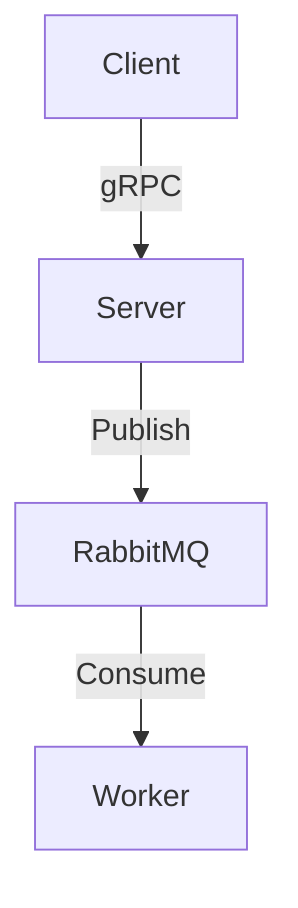

# 🐹 Go gRPC Benchmark Project

🚀 Este projeto demonstra uma arquitetura com foco em mensageria assíncrona, concorrência, instrumentação de desempenho e comunicação eficiente entre serviços.

Utilizando tecnologias amplamente adotadas pelo mercado, o projeto simula chamadas gRPC concorrentes e processa as mensagens via filas com alto desempenho e confiabilidade.

---

### 🛠️ Tecnologias Utilizadas

- 🐹 **[Go](https://golang.org/):** Linguagem principal, com foco em concorrência leve e desempenho.
- ⚡ **[gRPC](https://grpc.io/):** Comunicação eficiente e tipada entre client/server.
- 🐳 **[Docker](https://www.docker.com/):** Ambiente containerizado para fácil deploy e escalabilidade.
- 📬 **[RabbitMQ](https://www.rabbitmq.com/):** Mensageria assíncrona para desacoplamento e resiliência entre serviços.

---

### 🎯 Objetivos do Projeto

- Demonstrar conhecimento em **Go**, mesmo sem experiência profissional prévia.
- Aplicar conceitos modernos de **concorrência**, **mensageria** e **observabilidade**.
- Expor práticas reais e alinhadas com o mercado para **processamento assíncrono** e **gRPC benchmarking**.
- Servir como base para projetos futuros em Go, com **boas práticas e código limpo**.

---

---

## 🧱 Arquitetura

O sistema é composto por três serviços principais:

- `server`: serviço gRPC escrito em Go, que recebe requisições e publica mensagens em uma fila RabbitMQ.
- `worker`: consumidor da fila RabbitMQ, responsável por processar as mensagens assíncronas.
- `client`: simula chamadas concorrentes ao serviço gRPC e mede a latência das respostas, exportando os dados em CSV.



---

## 🔧 Tecnologias e Conceitos Utilizados

| Tecnologia / Conceito     | Aplicação no Projeto                                                                 |
|---------------------------|--------------------------------------------------------------------------------------|
| **Go**                    | Projeto idiomático com estrutura modular e uso de concorrência (`goroutines`, `WaitGroup`) |
| **gRPC**                  | Comunicação eficiente baseada em contrato com `.proto`                              |
| **RabbitMQ**              | Processamento assíncrono com retry, backoff e escuta contínua                        |
| **Docker / Docker Compose** | Orquestração de múltiplos serviços de forma local e replicável                        |
| **Mensageria Assíncrona** | Separação de responsabilidades e desacoplamento dos serviços                         |
| **Benchmark e Observabilidade** | Coleta de métricas de tempo por chamada com geração de CSV                          |
| **Resiliência**           | Reconexão com RabbitMQ usando backoff exponencial (`dialRabbitMQ()`)                |
| **Clean Logging**         | Logs semânticos e organizados para facilitar a leitura e diagnóstico                 |

---

## 🎯 Objetivos Técnicos Demonstrados

- ✅ Desenvolvimento de serviços gRPC idiomáticos em Go
- ✅ Uso de mensageria para desacoplamento e robustez
- ✅ Concorrência segura e eficiente com goroutines
- ✅ Estratégia de reconexão resiliente com retry/backoff
- ✅ Design modular e facilmente escalável
- ✅ Comunicação entre containers via Docker Compose
- ✅ Geração de relatórios de benchmark para análise de performance

---

## 📁 Organização do Código

```
/proto              # Definições .proto do serviço gRPC
/server             # Serviço gRPC com integração ao RabbitMQ
/worker             # Serviço consumidor das mensagens publicadas
/client             # Simulador de chamadas gRPC concorrentes e benchmark
/docker-compose.yml # Orquestração completa dos serviços
```

---

## 🚀 Como Executar

1. Clone o repositório:
```bash
git clone https://github.com/AlexandreTSato/go-grpc-rab-bitmq-docker.git
cd grpc-benchmark
```

2. Suba os containers:
```bash
docker-compose up --build
```

3. Acompanhe os logs:
```bash
docker-compose logs -f server
docker-compose logs -f worker
```

4. Execute o cliente em outro terminal:
```bash
docker-compose run client
```

---

## 📈 Exemplo de Saída (Client)

```txt
[#3] Resposta: pong: ping-3 | Tempo: 1.02s
[#7] Resposta: pong: ping-7 | Tempo: 1.01s
🔥 Total: 1.22s para 10 chamadas
✅ Resultados salvos em resultados.csv
```

---

## ⭐ Contribua

Se este projeto te ajudou ou inspirou, fique à vontade para dar um ⭐ ou abrir uma issue com sugestões de melhoria.

---
